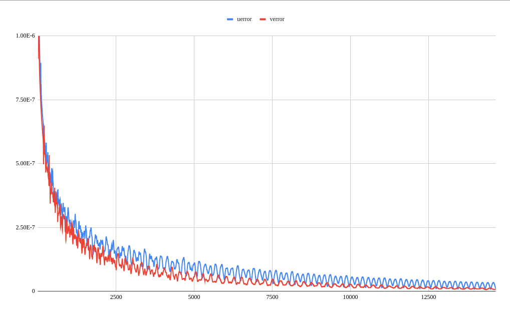
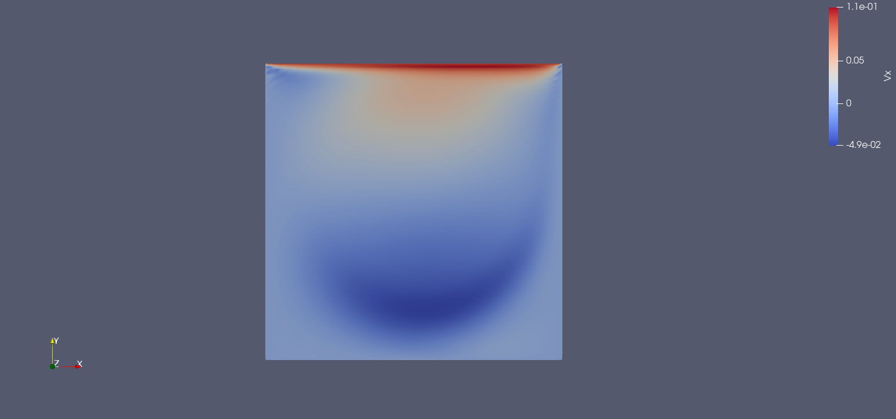
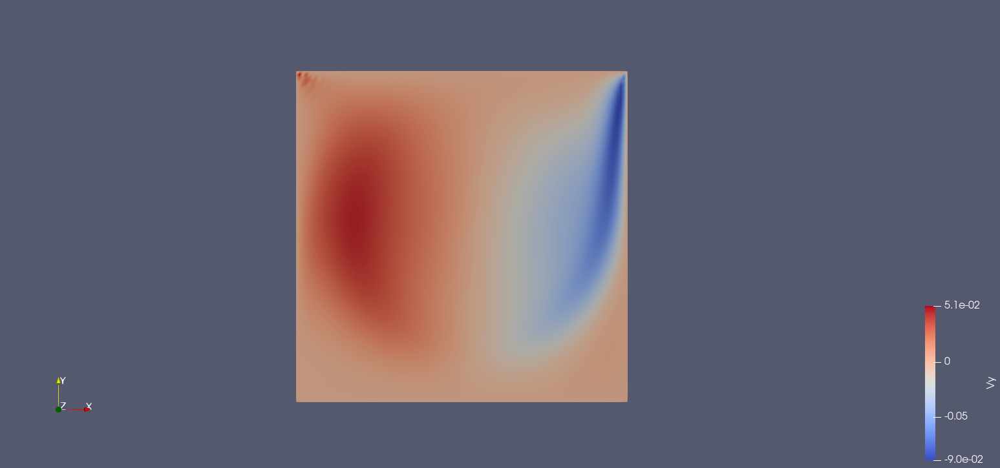
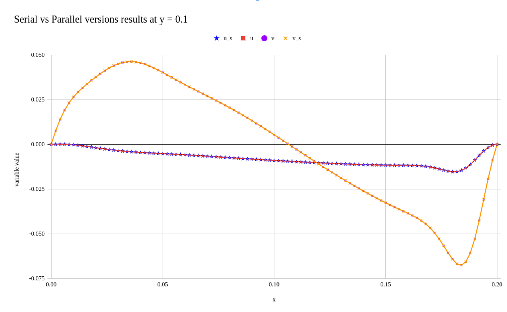

# Parallelisation of Classical LBM using OpenACC and Evaluation on 2D Lid driven cavity case. 

## Introduction :
This project presents the implementation of a classical Lattice Boltzmann Method (LBM) in C++ and its parallelization using OpenACC. The LBM solver exhibits significant potential for parallelization, particularly in the collision and streaming steps, which collectively consume around 90% of the total simulation time. To facilitate efficient computation, an abstract data structure is employed to store distribution values at each grid point. The implementation begins with the initialization of velocity, density, and distribution function vectors, followed by the execution of collision, streaming, and boundary condition application steps. The process iterates until a convergence criterion based on the error in velocities within a specified tolerance is met. 

Two main blocks of parallelism are utilized: the first block handles memory allocation for all variables and initialization on the GPU, while the second block operates within a while loop, managing iterations until convergence. It performs streaming and collision step updates on GPU and transfers error values. Upon convergence, the GPU transfers the complete solution to the CPU for further post-processing.

## Results and Validation :
Initially, a serial implementation of the model is developed, and its results are validated against benchmark Direct Numerical Simulation (DNS) results [1], utilizing a Reynolds number of 1000. The convergence behavior for a lattice grid size of 100x100 is illustrated in Figure 1. 

    

Convergence

Figure 2 and Figure 3 depict the velocity profiles for horizontal and vertical velocities plotted using the software ParaView, respectively, which were compared against the results obtained from Direct Numerical Simulation (DNS). 

    

Figure 2

    

Figure 3

In order to verify the consistency of results between the parallel and serial implementations, the velocities at x = 0.1 and y = 0.1 were plotted and compared. These comparisons are illustrated in Figure 4 and Figure 5. 

    

Figure 4

    

Figure 5

It was observed that the results obtained from both the parallel and serial codes matched perfectly, ensuring the correctness and reliability of the parallel implementation. The speedup achieved was calculated to be 22.54 when utilizing the optimal configuration of gangs, workers, and vectors. In this configuration, the parallel program converged in 7.59 seconds, whereas the equivalent serial program required 171.08 seconds to reach the same results. This significant speedup demonstrates the effectiveness of parallelization in improving computational efficiency.
